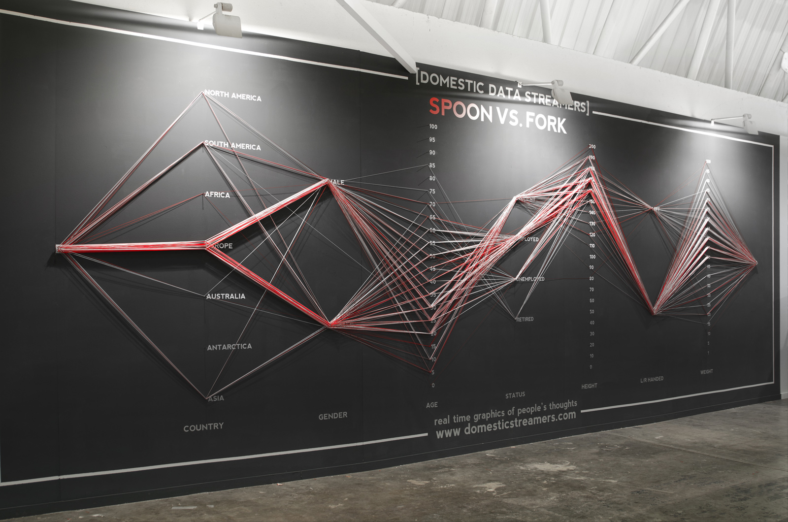
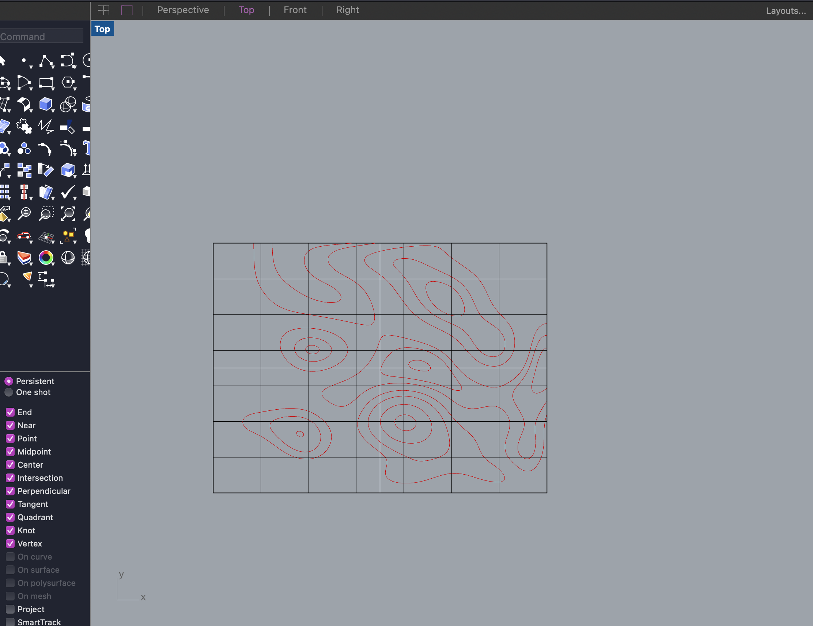
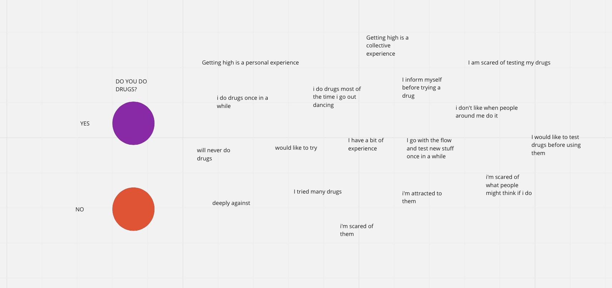
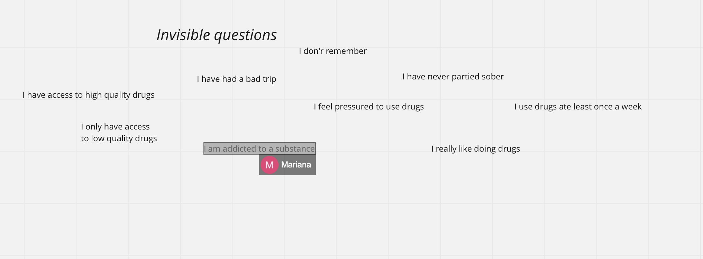

# MicroChallengeI

**DRUGS? YOU BETTER KNOW**

It’s no secret that drugs are commonly consumed at music festivals, dance clubs or raves.
Quite simply, people do it because it can enhance their experience. But we’re not here to justify, give reasons or explain why people do it.  It’s a fact.
Drug use exists, and there’s the urgent need to make it happen in the most safe way possible.
We take for granted that festival organizers know that drugs will get onto the site, so we believe it's a responsibility to make sure people remain safe. Denying the issue just causes fatalities.

“Festivals attract a wide array of people not experienced with party drugs. Relying on strangers inside to purchase drugs is a risk factor for purchasing adulterated products. Fear of security/police at festivals leads to risky drug-taking such as ingesting one’s full batch of drugs at the entrance. These risks are compounded by environmental factors including crowding, hot temperature, and lack of water and inadequate medical emergency response.”

https://harmreductionjournal.biomedcentral.com/articles/10.1186/s12954-022-00598-5

We want to help people to make informed and responsible choices, raising awareness about substances in circulation and reducing the chance of drug-related problems.

We hope for a local music policy that doesn’t deny the use of drugs but aims for harm reduction advice and support by showing how to do it safely, giving a non-judgmental service, accessible and available to all.

What are drugs?
Drugs are natural or artificial substances that can alter perception of reality, modify the level of consciousness, effect on psychophysical capacity and can easily become addictive. The substances reach the brain through the bloodstream, crossing the blood-brain barrier, promoting or inhibiting the reuptake of certain neurotransmitters such as serotonin, dopamine and noradrenaline at the synapse.
 Psychoactive substances can be divided into several categories: stimulants, psychedelics, downers, empathogens/entactogens and dissociatives.

 **OUR PROJECT**

 We wanna help people to communicate their ideas, opinion and experience about drugs without using the voice, by creating a tool that could help them speak without speaking.
 Why? Because sometimes seems hard to talk and express opinions about specific topics,  if it feels like they are being denied by society and there's no enough freedom to bring the conversation to the table, and especially to share a personal experience, positive or negative an habit or even an addiction related to something illegal and usually misread.

 The lack of communication and dialogue in the topic brings a huge lack of awareness and information in the topic itself. Also, sharing can prevent other people’s harm.

 We want people to feel comfortable in sharing personal opinions about drugs, that's why we designed a simple tool, a sharing board, that it's seen multiple times in different occasions, as a way to normalize the topic. We wanna give a non judgmental tool to gather data about drug use in different locations (street, music festival, bars, uni).

 Reference:
 

 We designed the board starting by a topography map to give a modularity aspect and not to limitate ourselves with a squared board. Also, the shapes of the topography allows to create different shape and adjust the board by preference.

Once that the shapes were fixed we developed a flow of answers that could represent statements related to drug and then we placed them in the rhino file.
We first prototyped the board in cardboard to test it out and then we laser cut it on plywood. Close to each answer we put a nail were a thread can be attached as a "yes I do"

**THE INVISIBLE ANSWERS**

We know that being honest, with themselves and others about drugs is not easy, so in order to allow people to feel more comfortable about sharing we came up with the idea of the invisible answers, more intimate and difficult statements that might be hard to point out.

These answers are not laser cut in the board, instead we printed weird shaped stickers (that are connected to aesthetic of the project) on blu vinyl and then sticked them on the board.
